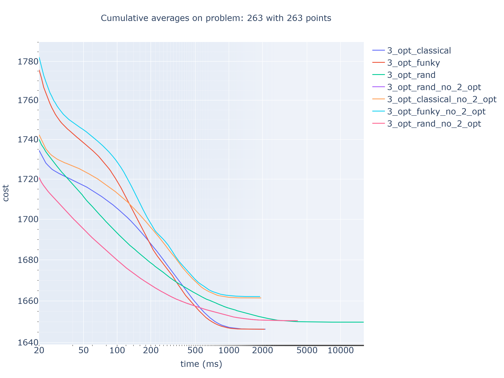
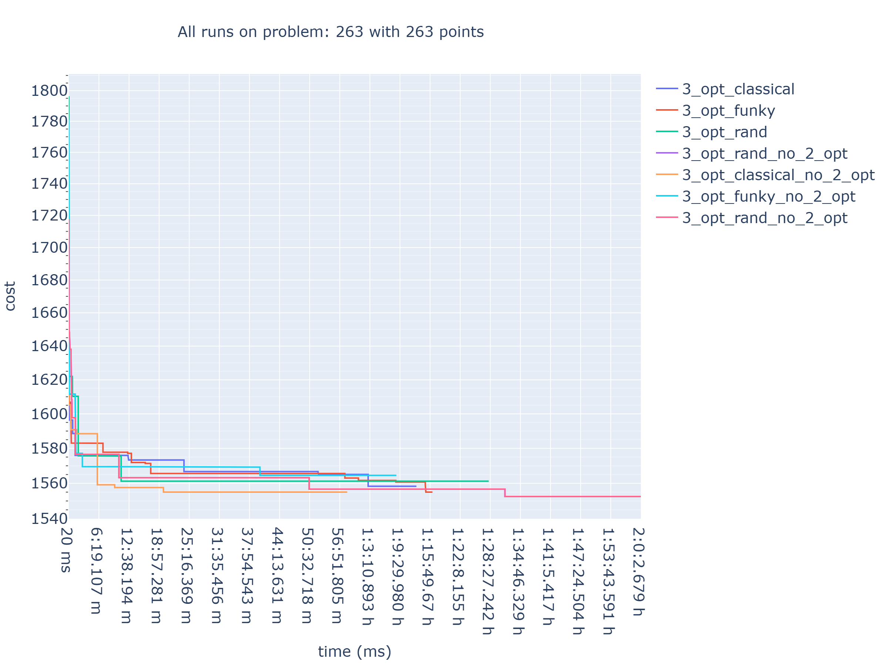

## K-opt Heuristic

Implementations solve the STSP and SSHP.

Previously researched and below presented 3-opt implementation has been transformed into k-opt, and heavily optimized. Rand has been merged with funky instead of classical. This research has shown that pure opt moves should be preferred at the beginning of the search resulting in higher quality solutions, and faster overall search.

### Optimized 3-opt Variants Comparison
Problem: '263', with 263 points. Optimal solution believed to be ~1545.

| Variant | Avg Cost | Best Cost | Time to Best | Total Time | Avg Run Time [ms] | Max Run Time [ms] | No. Runs |
|---------|----------|-----------|--------------|------------|--------------|---------------|------|
| 3_opt_classical | 1637.816 | 1546.172 | 3:32.71 m | 1:35:00.00 h | 212.599 | 557.000 | 26811 |
| 3_opt_best_cut | 1624.287 | 1549.347 | 53:34.40 m | 1:35:03.64 h | 5597.291 | 8220.000 | 1019 |
| 3_opt_funky | 1644.708 | 1546.172 | 13:11.10 m | 1:35:00.06 h | 98.636 | 396.000 | 57789 |
| 3_opt_rand | 1645.087 | 1546.172 | 1:13:13.92 h | 1:35:00.06 h | 294.455 | 772.000 | 19358 |
| 3_opt_rand_no_2_opt | 1631.719 | 1546.172 | 14:20.51 m | 1:35:00.08 h | 302.360 | 767.000 | 18852 |

## 3-opt Heuristic

Implementations solve the STSP and SSHP.

### 3-opt Variants Comparison
Problem: '263', with 263 points. Optimal solution believed to be ~1545.
5000 reruns per variant or 1h 45m to start last run timeout.

| Variant | Avg Cost | Best Cost | Time to Best | Total Time | Avg Run Time [ms] | Max Run Time [ms] | No. Runs |
|---------|----------|-----------|--------------|------------|--------------|---------------|------|
| 3_opt_classical | 1646.306 | 1549.347 | 59:18.13 m | 1:16:10.05 h | 914.010 | 2620.000 | 5000 |
| 3_opt_best_cut | 1626.588 | 1560.143 | 35:34.97 m | 1:45:18.04 h | 32400.215 | 41065.000 | 195 |
| 3_opt_funky | 1646.903 | 1549.347 | 10:56.37 m | 1:18:04.92 h | 936.985 | 2542.000 | 5000 |
| 3_opt_rand | 1649.717 | 1553.277 | 1:03:38.90 h | 1:20:03.30 h | 960.661 | 3027.000 | 5000 |
| 3_opt_classical_no_2_opt | 1661.872 | 1567.585 | 1:23:00.30 h | 1:45:00.42 h | 1795.503 | 5075.000 | 3509 |
| 3_opt_best_cut_no_2_opt | 1661.900 | 1585.995 | 1:19:22.21 h | 1:45:14.52 h | 36082.949 | 47513.000 | 175 |
| 3_opt_funky_no_2_opt | 1660.678 | 1578.461 | 49:44.72 m | 1:45:00.29 h | 2537.372 | 4919.000 | 2483 |
| 3_opt_rand_no_2_opt | 1641.198 | 1546.172 | 44:57.41 m | 1:45:00.49 h | 1795.522 | 5973.000 | 3509 |

### Video of rand_no_2_opt variant finding best solution

https://github.com/user-attachments/assets/5fbcd959-9697-4d4d-948b-8dfe71017470

 

 
More illustrations including the '3-opt' move, and the '3-opt no 2-opt except when 2 consecutive edges' are in `github_gallery/`.

## Bellman-Held-Karp
This is a heavily optimized single-core Bellman-Held-Karp implementation.

 Precision and memory constraints can be provided resulting in cleverly rescaling a weights matrix and automatically deciding on the lowest possible data type for storing the found cost. If given available memory is too small requiring too small a dtype then the accuracy will be lost and the found solution may not be optimal due to precision error.
 TSP is solved by removing the last point and solving SHP for N-1 points.
 Symmetric variant is solved up to cardinality ⌊N/2⌋ which is when the halves are merged.
 Asymmetric variant is solved normally up to N-1.
 Only minimal information required by the algo is stored and the code utilizes cache.
 Time complexity: O(n^2 * 2^n).
 Space complexity: O(n * 2^n), but in case of only searching for the optimal cost not the path: O(sqrt(n) * 2^n).

In `analysis/bellman_held_karp/263` are complete tables showing the exact memory consumption of this implementation for symmetric and asymmetric TSP and SHP with and without constructing optimal path, as well as merged runtimes on STSP and SSHP on small number of reruns just for demonstration; solving TSP with 30 points takes 105 seconds using float.

2B cost dtype is sufficient for problem 263 but 1B is not. Correctness can be checked using `commands/judge_results.py`.

## STSP (Symmetric Traveling Salesman Problem)

| n  | uint8_t | uint16_t | uint32_t | uint64_t | float | double |
|----|---------|---------|---------|---------|---------|---------|
| 10 | 1008.000 B | 1.723 KB | 3.199 KB | 6.152 KB | 3.199 KB | 6.152 KB |
| 11 | 3.223 KB | 5.273 KB | 9.375 KB | 17.578 KB | 9.375 KB | 17.578 KB |
| 12 | 5.317 KB | 8.862 KB | 15.952 KB | 30.132 KB | 15.952 KB | 30.132 KB |
| 13 | 15.727 KB | 25.008 KB | 43.570 KB | 80.695 KB | 43.570 KB | 80.695 KB |
| 14 | 26.254 KB | 42.593 KB | 75.271 KB | 140.626 KB | 75.271 KB | 140.626 KB |
| 15 | 73.404 KB | 114.461 KB | 196.574 KB | 360.801 KB | 196.574 KB | 360.801 KB |
| 16 | 123.970 KB | 197.285 KB | 343.916 KB | 637.178 KB | 343.916 KB | 637.178 KB |
| 17 | 333.953 KB | 512.703 KB | 870.203 KB | 1.548 MB | 870.203 KB | 1.548 MB |
| 18 | 569.832 KB | 892.699 KB | 1.502 MB | 2.764 MB | 1.502 MB | 2.764 MB |
| 19 | 1.459 MB | 2.210 MB | 3.712 MB | 6.717 MB | 3.712 MB | 6.717 MB |
| 20 | 2.511 MB | 3.880 MB | 6.619 MB | 12.098 MB | 6.619 MB | 12.098 MB |
| 21 | 6.441 MB | 9.645 MB | 16.052 MB | 28.866 MB | 16.052 MB | 28.866 MB |
| 22 | 11.172 MB | 17.059 MB | 28.832 MB | 52.378 MB | 28.832 MB | 52.378 MB |
| 23 | 28.166 MB | 41.734 MB | 68.868 MB | 123.137 MB | 68.868 MB | 123.137 MB |
| 24 | 49.174 MB | 74.268 MB | 124.457 MB | 224.835 MB | 124.457 MB | 224.835 MB |
| 25 | 122.185 MB | 179.317 MB | 293.582 MB | 522.110 MB | 293.582 MB | 522.110 MB |
| 26 | 214.523 MB | 320.796 MB | 533.341 MB | 958.432 MB | 533.341 MB | 958.432 MB |
| 27 | 526.523 MB | 765.991 MB | 1.216 GB | 2.151 GB | 1.216 GB | 2.151 GB |
| 28 | 929.038 MB | 1.344 GB | 2.219 GB | 3.967 GB | 2.219 GB | 3.967 GB |
| 29 | 2.203 GB | 3.180 GB | 5.132 GB | 9.038 GB | 5.132 GB | 9.038 GB |
| 30 | 3.905 GB | 5.738 GB | 9.404 GB | 16.735 GB | 9.404 GB | 16.735 GB |
| 31 | 9.396 GB | 13.459 GB | 21.585 GB | 37.838 GB | 21.585 GB | 37.838 GB |
| 32 | 16.718 GB | 24.374 GB | 39.687 GB | 70.311 GB | 39.687 GB | 70.311 GB |
| 33 | 39.903 GB | 56.763 GB | 90.483 GB | 157.922 GB | 90.483 GB | 157.922 GB |
| 34 | 71.252 GB | 103.128 GB | 166.879 GB | 294.382 GB | 166.879 GB | 294.382 GB |
| 35 | 168.842 GB | 238.630 GB | 378.207 GB | 657.360 GB | 378.207 GB | 657.360 GB |
| 36 | 302.464 GB | 434.803 GB | 699.480 GB | 1228.835 GB | 699.480 GB | 1228.835 GB |
| 37 | 712.120 GB | 1000.373 GB | 1576.880 GB | 2729.894 GB | 1576.880 GB | 2729.894 GB |
| 38 | 1279.462 GB | 1827.544 GB | 2923.708 GB | 5116.036 GB | 2923.708 GB | 5116.036 GB |
| 39 | 2994.895 GB | 4183.229 GB | 6559.897 GB | 11313.234 GB | 6559.897 GB | 11313.234 GB |

## Execution Report - STSP (30 pts) + SSHP (29 pts) on problem 263

### 28 points

| dtype | (u)int16_t | (u)int32_t | (u)int64_t | float | double |
|---|---|---|---|---|---|
| avg time [s] | 35.577 | 38.582 | 21.552 | 34.684 | 32.381 |
| time diff [%] | 65.076 | 79.018 | 0.000 | 60.934 | 50.245 |
| reruns | 10 | 17 | 1 | 10 | 11 |
| mem [GB] | 1.344 | 2.219 | 3.967 | 2.219 | 3.967 |
| mem diff [%] | 0.000 | 65.030 | 195.090 | 65.030 | 195.090 |

### 29 points

| dtype | (u)int16_t | (u)int32_t | (u)int64_t | float | double |
|---|---|---|---|---|---|
| avg time [s] | 73.369 | 76.801 | 39.797 | 63.476 | 56.993 |
| time diff [%] | 84.358 | 92.983 | 0.000 | 59.499 | 43.208 |
| reruns | 5 | 9 | 1 | 6 | 6 |
| mem [GB] | 3.180 | 5.132 | 9.038 | 5.132 | 9.038 |
| mem diff [%] | 0.000 | 61.413 | 184.240 | 61.413 | 184.240 |

### 30 points

| dtype | (u)int16_t | (u)int32_t | (u)int64_t | float | double |
|---|---|---|---|---|---|
| avg time [s] | 116.665 | 118.037 | 170.448 | 105.081 | 159.515 |
| time diff [%] | 11.024 | 12.329 | 62.206 | 0.000 | 51.802 |
| reruns | 4 | 7 | 1 | 4 | 3 |
| mem [GB] | 5.738 | 9.404 | 16.735 | 9.404 | 16.735 |
| mem diff [%] | 0.000 | 63.888 | 191.665 | 63.888 | 191.665 |
